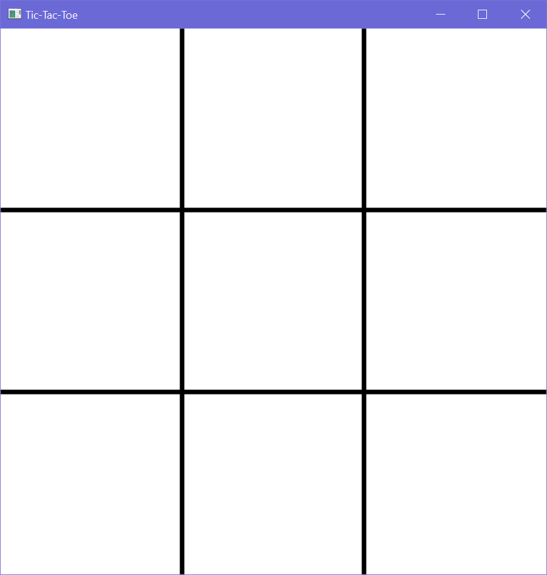
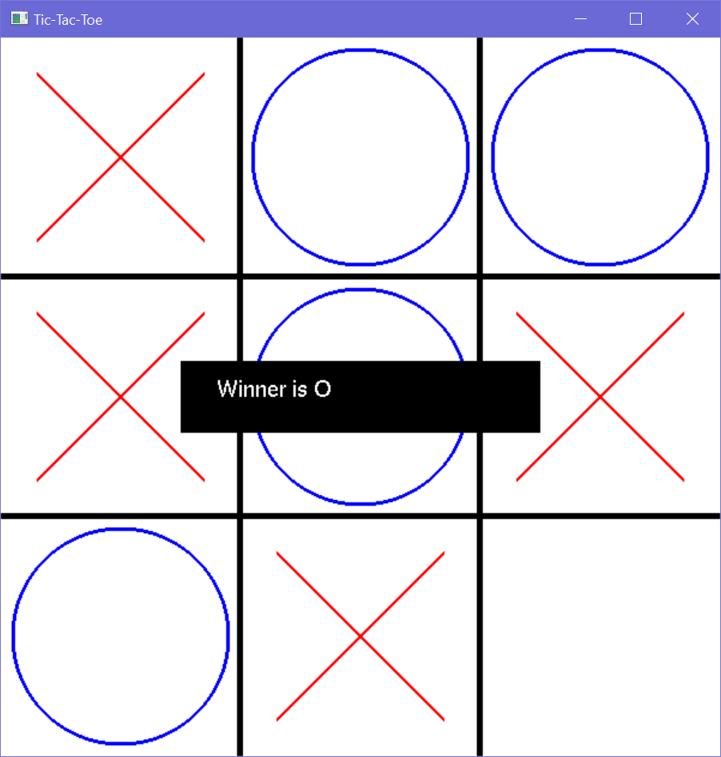

# 3x3 Tic-Tac-Toe Game using OpenGL

## Description

This project implements a **3x3 Tic-Tac-Toe** game using **OpenGL**. Two players take turns clicking on the grid to place **X** or **O**. The game automatically detects win conditions and declares the winner or a draw. Upon game completion, a banner is displayed at the center of the window with the result (Winner or Draw) in white text on a black background.

## How to Run this Project

1. **Install OpenGL on your PC**  
   Follow this video tutorial to install OpenGL: [OpenGL Installation Tutorial](https://www.youtube.com/watch?v=ISK6_7YpmS0&t=5s).

2. **Open the Project in CodeBlocks**  
   Make sure OpenGL is properly set up in your CodeBlocks IDE.

3. **Build and Run the Project**  
   Once the project is opened, simply build and run it to play the Tic-Tac-Toe game.

## Features

- 3x3 grid with clickable cells.
- X and O symbols drawn dynamically.
- Automatic detection of win conditions and draws.
- Result banner displayed in the center of the game window after game completion.

## Screenshots
- Grid (3X3)

- Game

## License

This project is open-source and free to use under the MIT License.
